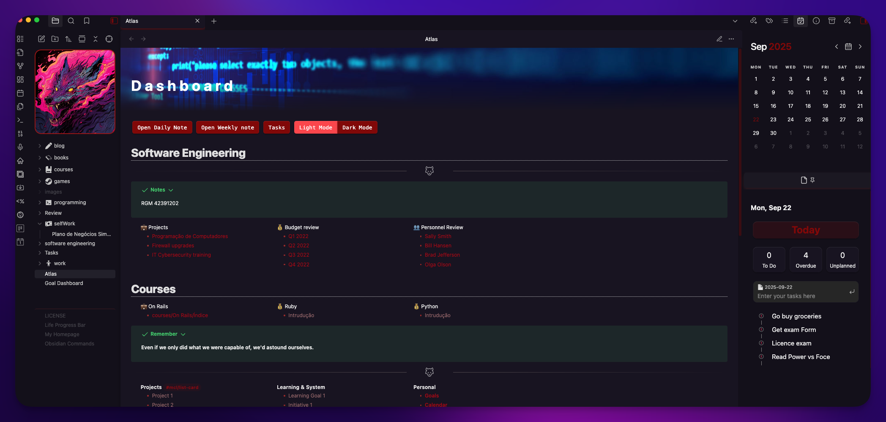
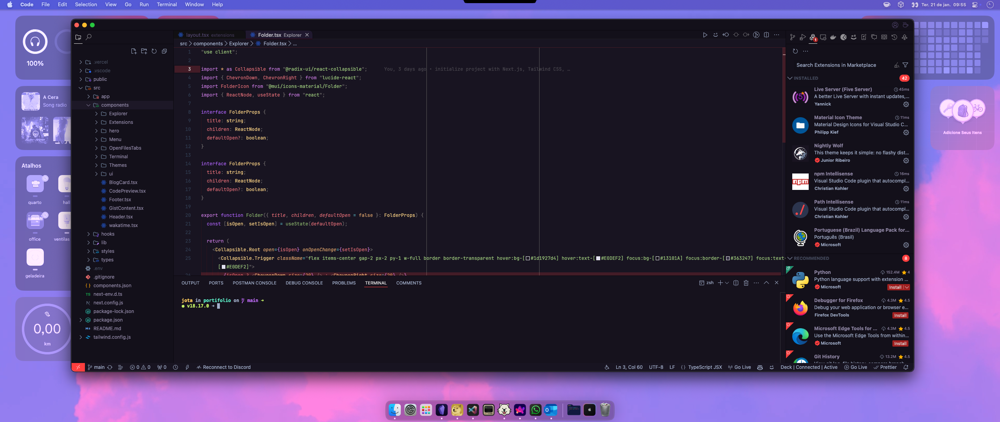

# NightlyWolf Theme for Obsidian 🐺

  
  

  A minimalistic and refined Obsidian theme.

---

### Description

**Nightly Wolf for Obsidian** brings the refined and distraction-free coding experience of my other theme: [Nightly Wolf Theme for VS Code](https://marketplace.visualstudio.com/items?itemName=jotacode.nightly-wolf-theme) to your personal knowledge base.

Designed with a focus on simplicity, it avoids flashy visuals and harsh colors, providing an eye-friendly and immersive environment for your notes, tasks, and creative work. Perfect for those late-night writing marathons or all-day research sprints, this theme ensures your comfort and focus remain undisturbed.

### Previews

|             Obsidian View             |            VS Code View            |
| :-----------------------------------: | :--------------------------------: |
|  |  |

### Features

- **Clean and Minimalistic Design:** Focus entirely on your content without unnecessary distractions.
- **Ergonomic & Custom Colors:** A unique dark purple color palette designed to be easy on the eyes during long sessions.
- **Translucent Sidebar:** A beautiful, semi-transparent effect on the left sidebar to create a sense of depth (this can be disabled via Style Settings if needed).
- **Custom Vault Logo:** Personalize your vault by adding a cover image directly into the file explorer.
- **Custom Indentation Guides:** Reddish connector lines in the file explorer and editor to make navigation clearer, inspired by developer tools.

### Installation

#### Obsidian Community Themes (waiting pr approval)

1.  In Obsidian, go to `Settings` > `Appearance`.
2.  Under the `Themes` section, click on `Manage`.
3.  In the search bar, type `Nightly Wolf`.
4.  Click `Install and use` to apply the theme.

---

### The Original: Nightly Wolf for VS Code

This theme was born in Visual Studio Code. If you are a dev, be sure to check out the original version!

- ➡️ [**View on VS Code Marketplace**](https://marketplace.visualstudio.com/items?itemName=jotacode.nightly-wolf-theme)
- ➡️ [**View on GitHub**](https://github.com/codejota/nightly-wolf)

### Feedback

Your feedback is invaluable! If you encounter any issues or have suggestions for the Obsidian theme, please open an [issue](https://github.com/codejota/nightly-wolf/issues) on our GitHub repository.

### License

This project is licensed under the MIT License. For more details, check the `LICENSE` file.

### Inspirations

- HackerTheBox

---

Thank you for using Nightly Wolf Theme. Happy noting! 🚀🐺

