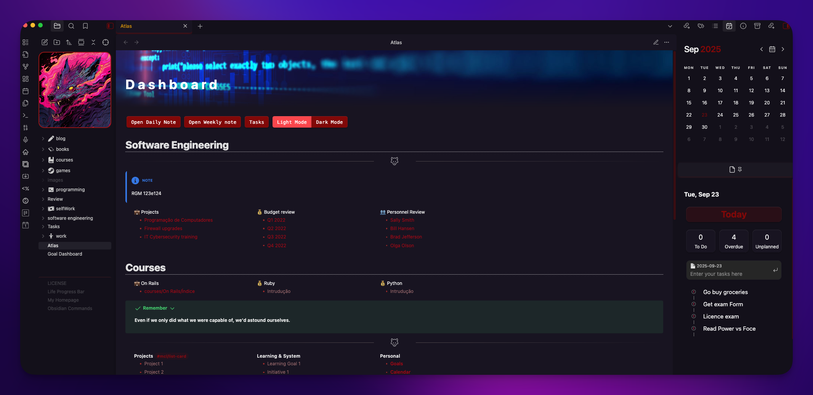

# NightlyWolf Theme for Obsidian 🐺

<p align="center">
  
  
</p>

<p align="center">
  A minimalistic and refined Obsidian theme.
</p>

---

### Description

**Nightly Wolf for Obsidian** brings the refined and distraction-free coding experience of my other theme: [Nightly Wolf Theme for VS Code](https://marketplace.visualstudio.com/items?itemName=jotacode.nightly-wolf-theme) to your personal knowledge base.

Designed with a focus on simplicity, it avoids flashy visuals and harsh colors, providing an eye-friendly and immersive environment for your notes, tasks, and creative work. Perfect for those late-night writing marathons or all-day research sprints, this theme ensures your comfort and focus remain undisturbed.

### Previews

_(Here you can add screenshots of your theme in action. I recommend capturing the main view, the calendar, a Kanban board, and the file explorer with the custom logo)_

|               Main View               |             on VS Code             |
| :-----------------------------------: | :--------------------------------: |
|  |  |

### Features

- **Clean and Minimalistic Design:** Focus entirely on your content without unnecessary distractions.
- **Ergonomic & Custom Colors:** A unique dark purple color palette designed to be easy on the eyes during long sessions.
- **Translucent Sidebar:** A beautiful, semi-transparent effect on the left sidebar to create a sense of depth (this can be disabled via Style Settings if needed).
- **Custom Vault Logo:** Personalize your vault by adding a cover image directly into the file explorer.
- **Custom Indentation Guides:** Reddish connector lines in the file explorer and editor to make navigation clearer, inspired by developer tools.

### Installation

#### Method 1: Manual Installation

1.  Download the `theme.css` file from this repository.
2.  In Obsidian, go to `Settings` > `Appearance`.
3.  Under the `Themes` section, click the `Manage` button and then open the themes folder.
4.  Place the downloaded `theme.css` file inside this folder.
5.  Return to Obsidian, click the refresh button next to `Themes`, and select `Nightly Wolf` from the dropdown menu.

#### Method 2: As a CSS Snippet

1.  In Obsidian, go to `Settings` > `Appearance`.
2.  Select `manage` in left side.
3.  Search for `Nightly Wolf`
4.  Click `Install and use` to install the theme.

### Customization: The Vault Logo

One of the key features of this theme is the ability to display a custom image at the top of your file explorer.

**How to set it up:**

1.  **Create a note:** Inside your vault, create a new note with the exact name `0-Vault-Logo`. The content of this note doesn't matter. The theme simply targets the note by its name in the file explorer.
2.  **Change the image (Optional):** To change the default image, you need to edit the `theme.css` file.
    - Find the section at the very end called `--- File Explorer: Custom Vault Logo ---`.
    - Locate the following line:
      ```css
      div[data-path="0-Vault-Logo"] {
        order: -1;
        background-size: cover;
        background-position: center;
        background-repeat: no-repeat;
        margin-bottom: 15px;
        width: 100%;
        min-height: 200px;
        border-radius: 15px;
        border: 2px solid rgb(149, 21, 21);
        background-image: url("https://i.imgur.com/30KbqyV.jpeg");
        /* here you can put any image link you want */
      }
      ```
    - Replace the URL inside `url()` with a link to your desired image.

---

### The Original: Nightly Wolf for VS Code

This theme was born in Visual Studio Code. If you are a dev, be sure to check out the original version!

- ➡️ [**View on VS Code Marketplace**](https://marketplace.visualstudio.com/items?itemName=jotacode.nightly-wolf-theme)
- ➡️ [**View on GitHub**](https://github.com/codejota/nightly-wolf)

### Feedback

Your feedback is invaluable! If you encounter any issues or have suggestions for the Obsidian theme, please open an [issue](https://github.com/codejota/nightly-wolf/issues) on our GitHub repository.

### License

This project is licensed under the MIT License. For more details, check the `LICENSE` file.

### Inspirations

- HackerTheBox

---

<p align="center">
Thank you for using Nightly Wolf Theme. Happy noting! 🚀🐺
</p>
